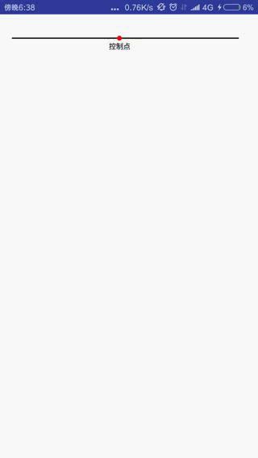
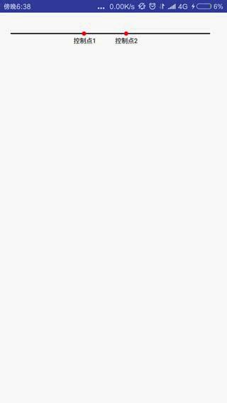
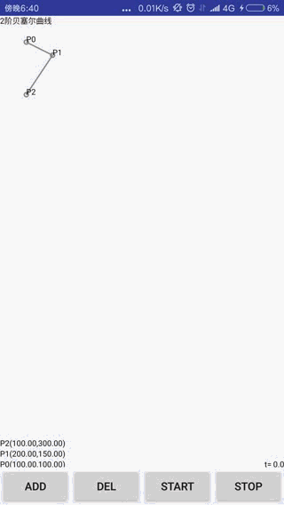
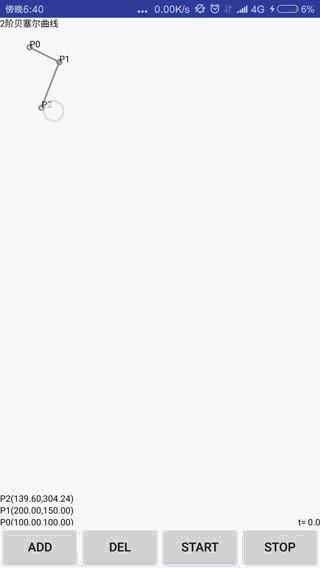
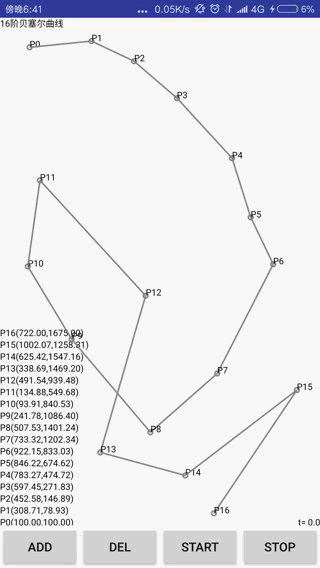

# Bezier
学习贝塞尔曲线时写的Demo,整理了部分代码  

#### 效果图  
> 通过Path.quadTo(x1, y1, x2, y2)方法实现的二阶贝赛曲线  

  
  
> 通过Path.cubicTo(x1, y1, x2, y2, x3, y3)方法实现三阶贝赛曲线  
  
  
  
> 通过自己写算法代码实现的N阶贝塞尔曲线  
  
      
  
> 通过贝赛尔曲线实现水波效果  
  
  
  
> 通过贝赛尔曲线实现点赞心漂浮路径  
  

